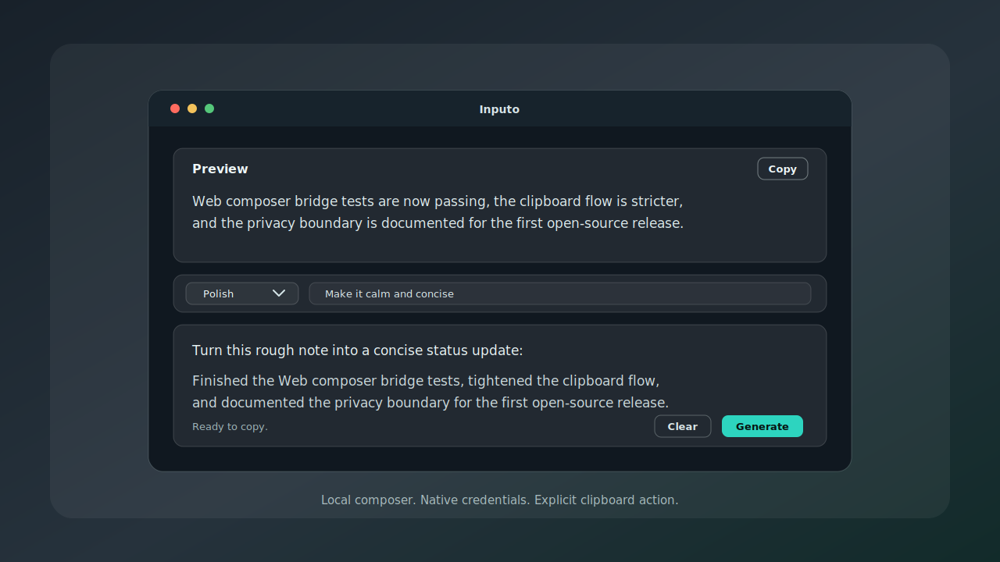
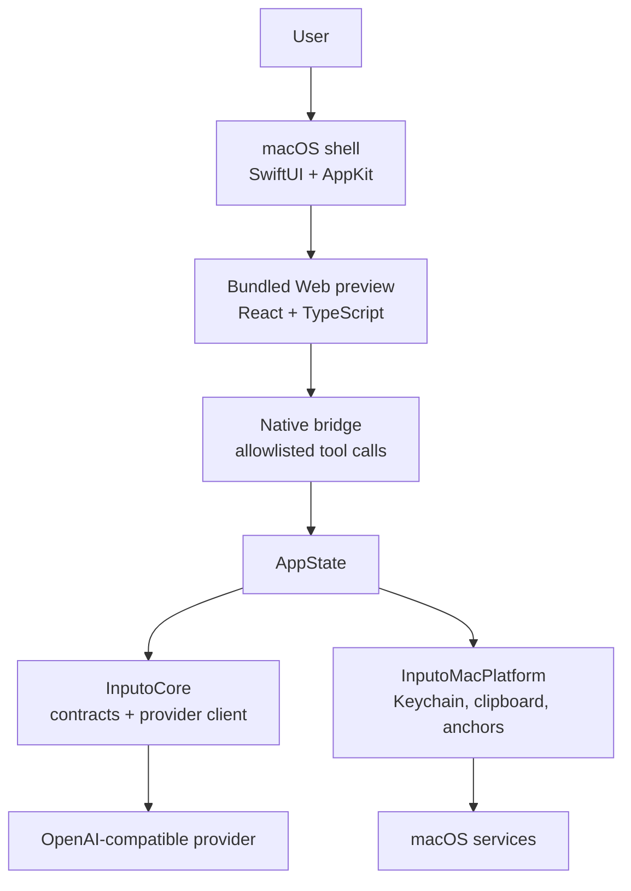

# Inputo

Inputo is a privacy-conscious macOS menu-bar app for system-wide AI text composition. Open a Spotlight-style composer, transform text with an OpenAI-compatible provider, copy the preview manually, and jump back to another app through app-level anchors.



Inputo is early-stage software. The current repository focuses on a working macOS app, native `/command` input, a bundled Web preview surface, shared contracts, and a careful native/Web trust boundary.

## Product Positioning

Inputo is for people who want a fast local composer in front of any app without giving a browser UI access to credentials or broad OS privileges.

It is designed around a few principles:

- native code owns OS privileges, credentials, provider networking, clipboard writes, app activation, permissions, and file grants
- native code owns the input box and built-in commands such as `/polish` and `/translate`
- Web code owns the preview surface and talks to native through a versioned, allowlisted bridge
- provider requests use an OpenAI-compatible `/v1/chat/completions` API configured by the user
- clipboard writes and app activation require explicit user action
- input and generated output are not stored as history

## Current Scope

- macOS SwiftUI/AppKit menu-bar app
- floating composer with keyboard shortcut support
- native `/command` composer with a hidden-by-default Web preview pop window
- React + TypeScript Web preview bundled into the app
- native bridge for allowlisted composer tools
- shared bridge contracts with Swift/Web drift checks
- OpenAI-compatible streaming provider requests from native code
- provider settings and API key storage through macOS services
- manual copy flow and app-level jump anchors
- grant-scoped native file read/write UX for assisted workflows
- compact safe diagnostics and permission-state display
- Swift package tests, Web preview tests, generated-asset verification, and GitHub Actions CI

## Privacy Boundary

Inputo's default privacy boundary is intentionally narrow:

- no input history or generated output history
- no screenshots
- no window-title capture
- no target-control content capture
- no automatic paste
- no provider API keys in Web storage or Web snapshots
- no browser-side provider networking
- no arbitrary local file reads from Web code

Read [PRIVACY.md](PRIVACY.md) and [docs/ARCHITECTURE.md](docs/ARCHITECTURE.md) for the full boundary.

## Install

There is no signed public release yet. For now, build from source on macOS:

```bash
xcodebuild -project apps/macos/Inputo.xcodeproj -scheme Inputo -configuration Debug -derivedDataPath .build/XcodeDerivedData CODE_SIGNING_ALLOWED=NO build
```

Or open `apps/macos/Inputo.xcodeproj` in Xcode and run the `Inputo` scheme.

On first launch, open **Inputo > Settings** from the menu-bar item, add an OpenAI-compatible base URL, model, and API key, then record a shortcut.

## Development

Prerequisites:

- macOS with Xcode and SwiftPM on `PATH`
- Node.js and pnpm 11 when editing `packages/web-composer`

Install Web dependencies only when changing the Web preview:

```bash
pnpm --dir packages/web-composer install
```

Every macOS or contract change should keep these commands passing:

```bash
swift test --package-path apps/macos/InputoModules
xcodebuild -project apps/macos/Inputo.xcodeproj -scheme Inputo -configuration Debug -derivedDataPath .build/XcodeDerivedData CODE_SIGNING_ALLOWED=NO build
```

Every Web preview change should also pass:

```bash
pnpm --dir packages/web-composer run verify
```

Read [docs/DEVELOPMENT.md](docs/DEVELOPMENT.md) for setup, QA, generated Web assets, and troubleshooting.

## Architecture



The Xcode project is intentionally thin. Product behavior lives in the local Swift package at `apps/macos/InputoModules`; the Web preview source lives in `packages/web-composer` and generates checked-in app resources.

## Documentation

- [Project structure](docs/PROJECT_STRUCTURE.md): monorepo map, directory responsibilities, and dependency direction.
- [Architecture](docs/ARCHITECTURE.md): system architecture, runtime flow, trust boundaries, and privacy defaults.
- [Development](docs/DEVELOPMENT.md): setup, verification commands, QA checklist, and troubleshooting.
- [Roadmap](docs/ROADMAP.md): planned milestones, near-term backlog, and definition of done.
- [Open source readiness](docs/OPEN_SOURCE.md): checklist for public repository launch.
- [Support](SUPPORT.md): where to ask questions and how to keep reports redacted.
- [Web preview](docs/WEB_COMPOSER.md): React/Vite development, bundling, deployment, debugging, and WKWebView constraints.
- [Web UI architecture](docs/WEB_UI_ARCHITECTURE.md): Web UI ownership model, state flow, bridge rules, and future agent boundary.
- [Native executor contract](docs/NATIVE_EXECUTOR_CONTRACT.md): native bridge envelope, tool policy, events, errors, and implementation locations.
- [M5 handover prompt](docs/M5_HANDOVER_PROMPT.md): fresh-thread prompt for starting the Web Agent Planner work.
- [Third-party notices](THIRD_PARTY_NOTICES.md): direct dependency license notes.

## Roadmap

The Pre-M5 UI split is implemented: native input, `/command` routing, native built-in commands, and a hidden-by-default Web preview pop window. Next priority is a no-Node customizable preview runtime, then Milestone 5: a visible Web Agent Planner with activity timeline and tool proposal state. Runtime QA should continue in parallel. See [docs/ROADMAP.md](docs/ROADMAP.md).

## What Inputo Is Not

Inputo is not currently:

- an autonomous desktop agent
- a keylogger, screen reader, screenshot pipeline, or window-title collector
- an automatic paste tool
- a hosted Web app
- a bundled Node/npm project runner
- an MCP or connector runtime
- a file-system automation tool without native user grants
- a replacement for reviewing your provider's privacy and retention policy

## Contributing

Contributions are welcome. Start with [CONTRIBUTING.md](CONTRIBUTING.md), follow the [Code of Conduct](CODE_OF_CONDUCT.md), and keep privacy-sensitive changes explicit in issues and pull requests.

For support questions, see [SUPPORT.md](SUPPORT.md).

Please report vulnerabilities privately through [SECURITY.md](SECURITY.md).

## License

Inputo is licensed under the [Apache License 2.0](LICENSE). Contributions intentionally submitted to this repository are accepted under the same license unless marked otherwise.
