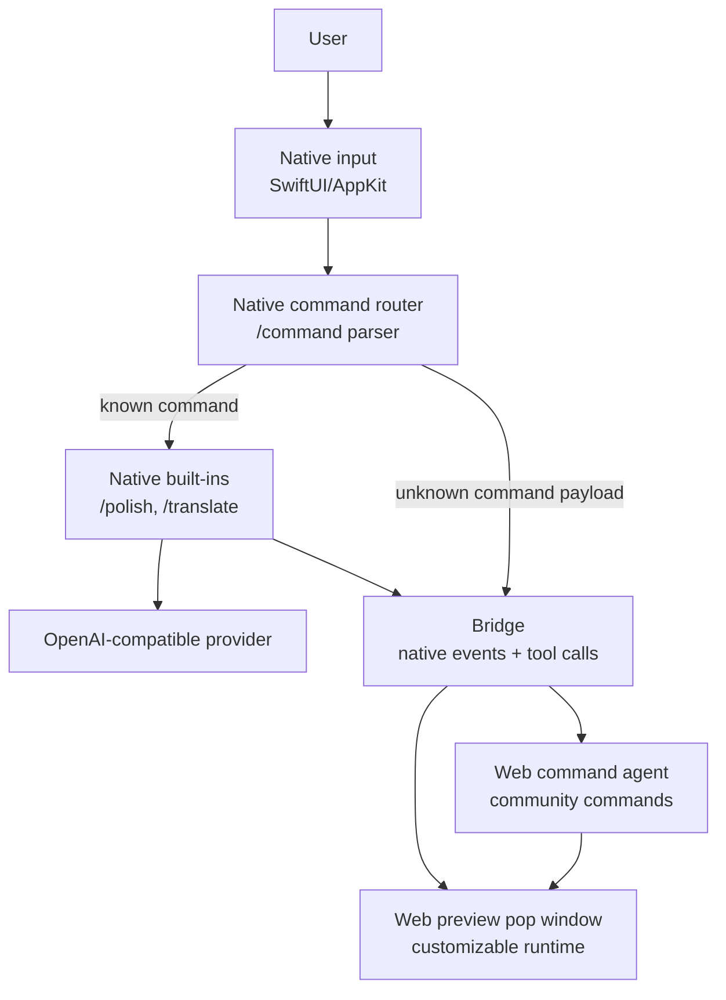
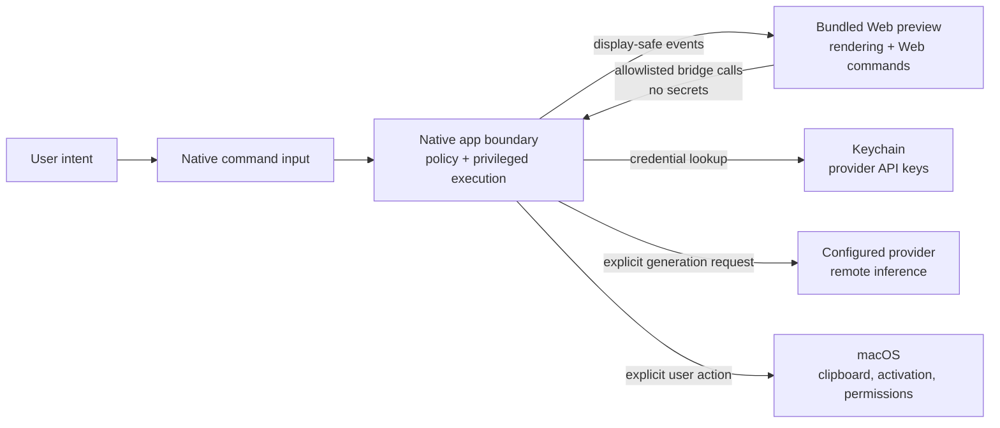
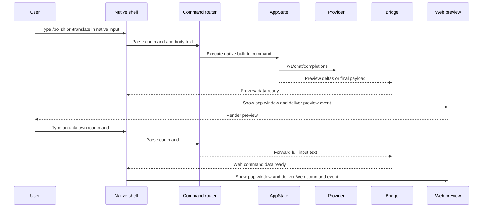
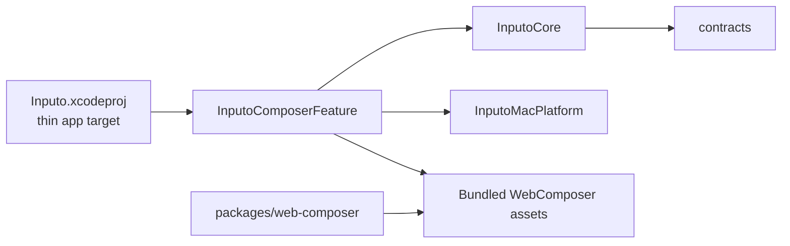

# Inputo Architecture

Inputo is a macOS menu-bar app for system-wide AI text composition. The user opens a floating native command input, writes a `/command`, asks an OpenAI-compatible provider to transform text, reviews the Web preview pop window, manually copies the preview, and jumps back to another app through app-level anchors.

The current product is a native macOS shell with a bundled Web preview surface. Native code owns OS integration, input, `/command` parsing, built-in commands, credentials, provider networking, clipboard writes, permissions, and app activation. Web code owns preview rendering and community command intake, and talks to native through an allowlisted bridge.

The Web preview is hidden by default. Native shows it when bridge data is delivered, such as native LLM streaming output or an unrecognized command that should be handled by Web.

## System Overview

## Native Input And Web Preview Shape

Known commands stay native when they need provider credentials or OS capabilities. Unknown `/command` input is sent to Web as full text so community-defined commands can orchestrate from the preview/agent layer. The preview window remains hidden until native or Web sends preview data.

## Trust Boundaries

Inputo has three important trust boundaries:

- Web can request only allowlisted native tools through versioned envelopes.
- Native validates tool policy before executing platform work.
- API keys stay in Keychain and are not included in Web snapshots, settings summaries, logs, or bridge events.
- Provider requests leave the device only after the user triggers generation.
- Clipboard writes, app activation, and future file access remain native-mediated actions.
- File access should be grant-scoped through native pickers or save panels, not arbitrary Web-supplied paths.

## Runtime Flow

## Ownership Boundaries

The Xcode app target is intentionally thin. Product behavior lives in the local Swift package at `apps/macos/InputoModules`.

- `apps/macos/Inputo`: app lifecycle, menu bar, floating panel, settings window hosting.
- `InputoCore`: Foundation-only contracts, provider configuration, transform recipes, provider request/response models, and native executor DTOs.
- `InputoMacPlatform`: macOS adapters for Keychain, clipboard, anchors, app activation, hotkeys, settings persistence, and file grants.
- `InputoComposerFeature`: composer/settings UI, `AppState`, bridge dispatcher, bridge host, and WKWebView host.
- `packages/web-composer`: React preview source and Vite build pipeline.
- `contracts`: language-neutral schemas and examples used by future platforms.

## Web Runtime Boundary

The Web preview is bundled static HTML, CSS, and JavaScript loaded by `WKWebView` from the SwiftPM resource bundle. It is not a remote web app.

Native owns:

- API key storage and retrieval
- provider networking
- clipboard writes
- app anchor discovery and activation
- file picker/save panel grants
- permission state
- settings persistence
- the main input box
- `/command` parsing
- built-in instruction commands such as `/polish` and `/translate`
- showing and hiding the preview pop window in response to bridge data
- panel lifecycle, placement, focus, and Escape behavior

Web owns:

- preview rendering
- community-defined command orchestration for commands native does not recognize
- dynamic preview document rendering within a restricted runtime in a future Preview Runtime slice
- future agent timeline and tool proposal UI

Web must not perform built-in provider requests directly, persist input/output history by default, read arbitrary local files, call privileged native tools without bridge policy, or bypass native confirmation policy.

The shipped app should not bundle Node, Bun, npm install, or a project runner for the Pre-M5 split or Preview Runtime V1. A sidecar runtime for arbitrary npm projects is intentionally deferred until the no-Node preview runtime proves insufficient.

## Privacy Defaults

Inputo does not store input history, generated text history, screenshots, window titles, target-control contents, or provider API keys in Web storage. API keys live in the platform credential store. The app uses app-level anchors and avoids screen recording by default.

## Open Source Review Points

When reviewing external contributions, pay special attention to changes that:

- move provider networking, credential handling, clipboard writes, app activation, file access, or permission prompts from native code into Web code
- add persistence for prompts, generated output, provider responses, local paths, screenshots, window titles, or diagnostics
- expose provider URLs with credentials, stack traces, local paths, or sensitive OS details to Web or public logs
- expand bridge tools without updating policy metadata, tests, fixtures, and documentation
- weaken explicit user-action checks around clipboard writes, app activation, provider calls, file grants, or future native executors
- introduce remote scripts, hosted Web assets, analytics, telemetry, crash reporting, or external network access outside the configured provider request path
- add Node/Bun/npm project execution or browser network access without a separate capability, policy, sandbox, and privacy review
- add dependencies that affect release licensing, signing, notarization, or sandbox behavior

When in doubt, keep the capability native, require visible user intent, return display-safe data, and update [PRIVACY.md](../PRIVACY.md), [NATIVE_EXECUTOR_CONTRACT.md](NATIVE_EXECUTOR_CONTRACT.md), and [DEVELOPMENT.md](DEVELOPMENT.md).

## Future Platforms

The repository is structured as a monorepo so the macOS shell, future Windows shell, Web preview, and shared contracts can evolve together. Windows should mirror the same boundary:

- WinUI/WebView2 for the platform shell
- Credential Manager for secrets
- Win32 interop for app/window activation
- the same bridge contract and language-neutral schemas
- platform-specific native executors for privileged capabilities

Future shared native core work can move pure provider, prompt, and contract logic below both platforms, but OS permissions, credentials, clipboard, app activation, and UI hosting should remain platform-native.
