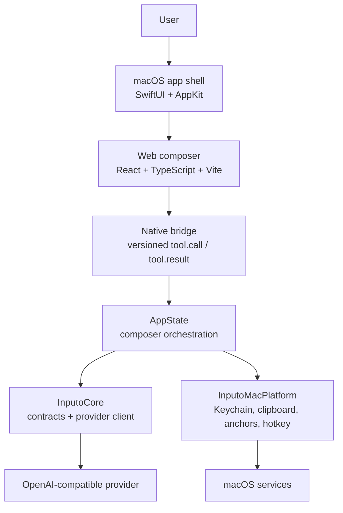
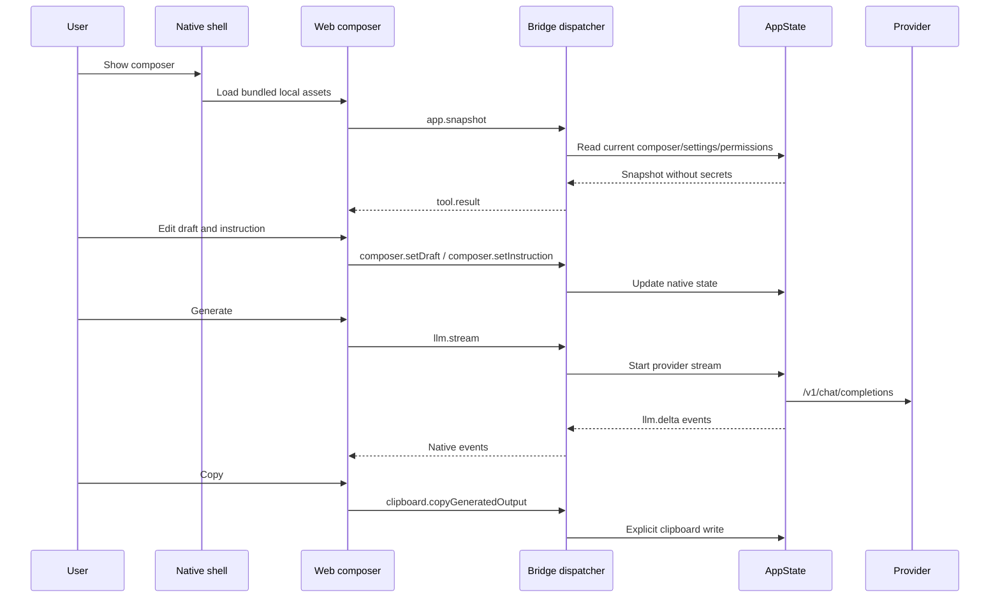
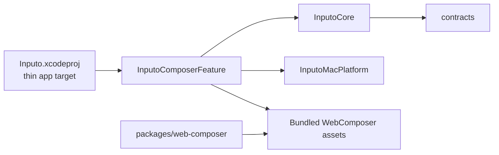

# Inputo Architecture

Inputo is a macOS menu-bar app for system-wide AI text composition. The user opens a floating composer, writes or pastes text, asks an OpenAI-compatible provider to transform it, manually copies the preview, and jumps back to another app through app-level anchors.

The current product is a native macOS shell with a bundled Web composer body. Native code owns OS integration, credentials, provider networking, clipboard writes, permissions, and app activation. Web code owns only the composer body UI and talks to native through an allowlisted bridge.

## System Overview

## Runtime Flow

## Ownership Boundaries

The Xcode app target is intentionally thin. Product behavior lives in the local Swift package at `apps/macos/InputoModules`.

- `apps/macos/Inputo`: app lifecycle, menu bar, floating panel, settings window hosting.
- `InputoCore`: Foundation-only contracts, provider configuration, transform recipes, provider request/response models, and native executor DTOs.
- `InputoMacPlatform`: macOS adapters for Keychain, clipboard, anchors, app activation, hotkeys, settings persistence, and file grants.
- `InputoComposerFeature`: composer/settings UI, `AppState`, bridge dispatcher, bridge host, and WKWebView host.
- `packages/web-composer`: React composer source and Vite build pipeline.
- `contracts`: language-neutral schemas and examples used by future platforms.

## Web Runtime Boundary

The Web composer is bundled static HTML, CSS, and JavaScript loaded by `WKWebView` from the SwiftPM resource bundle. It is not a remote web app.

Native owns:

- API key storage and retrieval
- provider networking
- clipboard writes
- app anchor discovery and activation
- file picker/save panel grants
- permission state
- settings persistence
- panel lifecycle, placement, focus, and Escape behavior

Web owns:

- composer body layout
- draft and instruction editing
- recipe selection control
- preview rendering
- Generate, Cancel, Clear, and Copy controls
- native event rendering and local interaction state

Web must not perform provider requests directly, persist input/output history, read arbitrary local files, call remote tools, or bypass native confirmation policy.

## Privacy Defaults

Inputo does not store input history, generated text history, screenshots, window titles, target-control contents, or provider API keys in Web storage. API keys live in the platform credential store. The app uses app-level anchors and avoids screen recording by default.

## Future Platforms

The repository is structured as a monorepo so the macOS shell, future Windows shell, Web composer, and shared contracts can evolve together. Windows should mirror the same boundary:

- WinUI/WebView2 for the platform shell
- Credential Manager for secrets
- Win32 interop for app/window activation
- the same bridge contract and language-neutral schemas
- platform-specific native executors for privileged capabilities

Future shared native core work can move pure provider, prompt, and contract logic below both platforms, but OS permissions, credentials, clipboard, app activation, and UI hosting should remain platform-native.
