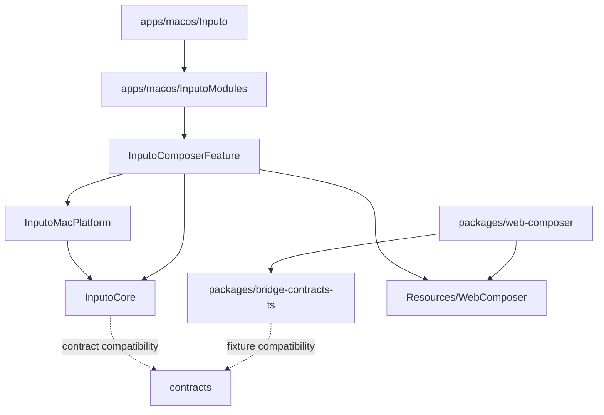

# Project Structure

Inputo is organized as a monorepo for the macOS app, the bundled Web composer, shared contracts, and future platform work.

```text
apps/
  macos/
    Inputo.xcodeproj/
    Inputo/
    InputoModules/
    InputoTests/
    InputoUITests/
  windows/
packages/
  web-composer/
  bridge-contracts-ts/
contracts/
docs/
tools/
```

## Directory Responsibilities

| Path | Responsibility |
| --- | --- |
| `apps/macos/Inputo.xcodeproj` | Thin Xcode project for the macOS app target. |
| `apps/macos/Inputo` | App lifecycle, menu bar, floating panel, and settings-window host code. |
| `apps/macos/InputoModules` | Local Swift package containing product modules and tests. |
| `apps/macos/InputoModules/Sources/InputoCore` | Foundation-only models, provider client, recipes, and bridge DTOs. |
| `apps/macos/InputoModules/Sources/InputoMacPlatform` | macOS platform services and OS adapters. |
| `apps/macos/InputoModules/Sources/InputoComposerFeature` | Composer feature, settings UI, app state, bridge dispatcher, and WKWebView host. |
| `apps/macos/InputoModules/Sources/InputoComposerFeature/Resources/WebComposer` | Checked-in production Web assets copied into the app bundle. |
| `packages/web-composer` | React + TypeScript + Vite source workspace for the Web composer body. |
| `packages/bridge-contracts-ts` | Shared TypeScript bridge DTOs, tool descriptors, event names, and helper types consumed by Web packages. |
| `apps/windows` | Reserved location for the future WinUI/WebView2 shell. |
| `contracts` | Language-neutral schemas and JSON fixtures. |
| `docs` | Architecture and development documentation. |
| `tools` | Reserved location for repository automation scripts. |

## Dependency Direction



The macOS build must not depend on `pnpm install`, a Vite dev server, or network access. The app consumes checked-in Web assets. Developers regenerate those assets explicitly from `packages/web-composer`.

## Where New Code Goes

- App lifecycle and window behavior: `apps/macos/Inputo`.
- Cross-platform DTOs, provider models, and pure logic: `InputoCore`.
- macOS system APIs: `InputoMacPlatform`.
- Composer or settings product behavior: `InputoComposerFeature`.
- Web composer UI: `packages/web-composer/src/app`, `packages/web-composer/src/features`, and `packages/web-composer/src/shared`.
- Shared TypeScript bridge contracts: `packages/bridge-contracts-ts`.
- Generated production Web assets: `InputoComposerFeature/Resources/WebComposer`.
- Cross-platform schemas or examples: `contracts`.
- Build or repository automation: `tools`.

Keep new dependencies pointed inward. Web code may depend on `packages/bridge-contracts-ts` and browser APIs. Native bridge implementations may depend on `AppState`. `InputoCore` should remain free of SwiftUI, AppKit, WebKit, and platform credential APIs.
