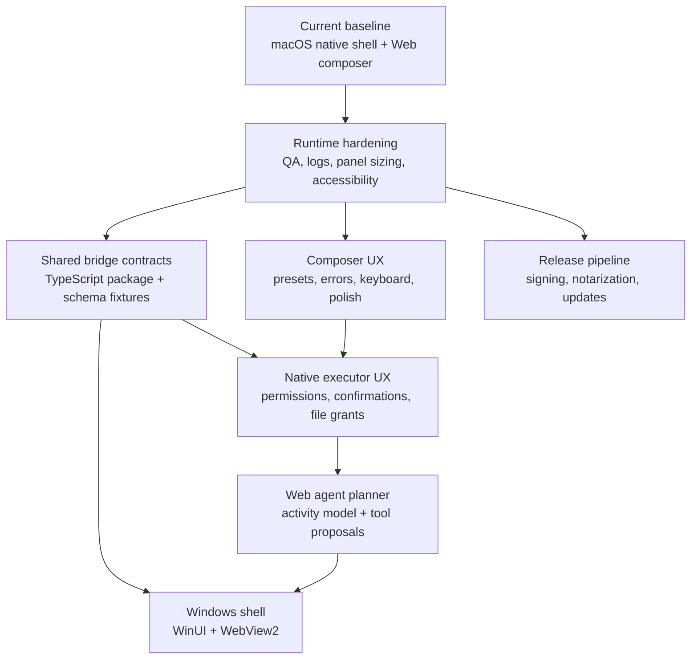

# Roadmap

This roadmap describes the development path from the current macOS app toward a cross-platform native shell plus shared Web composer architecture. It is organized by product capability and engineering risk, not by historical phases.

## Current Baseline

Inputo currently has:

- a macOS menu-bar app with a Spotlight-like floating composer
- native settings for provider configuration, API key storage, and shortcut recording
- app-level Jump anchors
- a React + TypeScript Web composer body hosted in `WKWebView`
- checked-in bundled Web assets generated from `packages/web-composer`
- a native executor bridge for allowlisted Web-to-native tool calls
- shared TypeScript bridge contracts with Swift/Web drift checks
- streaming OpenAI-compatible provider requests through native code
- grant-scoped file read/write UX behind native confirmation in assisted workflow mode
- compact Web diagnostics and permission-state surfaces that expose only safe setup metadata
- Swift package tests, frontend tests, generated-asset verification, and CI

Milestones 1 through 4 are implemented as the current foundation. Formal milestone closure still requires a completed manual runtime QA pass using [docs/MILESTONE_RUNTIME_QA.md](MILESTONE_RUNTIME_QA.md), especially for display placement, full-screen Spaces, appearance, reduced motion, IME, VoiceOver, native confirmation, and file-grant flows.

## Guiding Principles

- Keep OS privileges native.
- Keep Web UI reusable across macOS and future Windows.
- Keep Xcode builds independent of Node, pnpm install, a dev server, and network access.
- Keep bridge contracts explicit, versioned, typed, and policy-checked.
- Keep privacy defaults conservative: no automatic paste, no input/output history, no screenshots, no window-title capture, and no browser-side provider networking.

## Development Map

## Completed Foundation: Milestones 1-4

The current foundation combines:

- Milestone 1 runtime hardening: bundled Web assets, WKWebView constraints, CI checks, expected WebKit log documentation, focus/keyboard/IME safeguards, and repeatable QA checklist.
- Milestone 2 composer UX: actionable provider setup, polished generation/cancel/copy/clear states, compact panel styling, keyboard flow, accessibility labels, stale-event protection, and reducer/controller tests.
- Milestone 3 shared bridge contracts: `packages/bridge-contracts-ts`, `contracts/bridge-tools.v1.json`, Swift/Web drift checks, and contract ownership docs.
- Milestone 4 native executor UX: native-mediated per-call confirmation, permission state surfacing, grant-scoped file read/write UX, cancellation semantics, and policy tests.

Remaining closure work for this foundation is manual QA evidence, not new architecture.

## Milestone 5: Web Agent Planner

Goal: let Web orchestrate multi-step workflows while native remains the executor.

P0 scope:

- add an activity timeline model for generation, proposals, approvals, tool results, failures, and cancellation
- introduce tool proposal and approval states in Web without allowing Web to bypass native policy
- let Web coordinate `llm.stream` plus native tool proposals using existing bridge contracts
- add renderer slots for safe tool results
- define safe pure-Web tools separately from privileged native tools
- preserve request ordering, cancellation, late-event handling, and display-safe errors

Non-goals for the first M5 slice:

- no autonomous background execution
- no manifest-governed `network.fetch`
- no external MCP or connector runtime
- no screenshots, window-title capture, automatic paste, or browser-side provider networking
- no persistence of prompts, generated output, activity history, or local file paths

Exit criteria:

- Web can plan a visible workflow but cannot execute privileged actions without native policy
- every privileged action is represented as a proposal and remains cancellable or rejectable where appropriate
- timeline state is test-covered for completion, failure, cancellation, and stale events
- docs and privacy claims still match implementation

## Milestone 6: Windows Shell Preparation

Goal: make the existing architecture portable to a WinUI/WebView2 host.

Work:

- define the Windows app folder shape under `apps/windows`
- mirror the native bridge host over WebView2
- map credentials to Windows Credential Manager
- map app anchors to Win32 app/window activation
- reuse `packages/web-composer` and shared bridge contracts
- keep Windows-specific platform services separate from shared contracts

Exit criteria:

- Windows can load the same Web composer bundle
- platform services are native equivalents, not Web workarounds
- shared contracts do not assume AppKit or SwiftUI

## Milestone 7: Release Pipeline

Goal: prepare Inputo for repeatable external testing.

Work:

- decide app identifier, signing, and entitlement policy
- add release build verification
- add notarization and packaging notes
- define update strategy
- add privacy statement and diagnostic logging policy
- document supported macOS versions and provider compatibility

Exit criteria:

- a release candidate can be built from a clean checkout
- signing/notarization steps are documented and repeatable
- runtime privacy claims match implementation

## Near-Term Backlog

Highest priority:

- start Milestone 5 with visible activity timeline and tool proposal state
- finish manual runtime QA across display, Space, appearance, reduced-motion, IME, and VoiceOver scenarios
- keep bridge contract fixtures, Swift DTOs, TypeScript DTOs, generated assets, and docs updated together
- keep docs and CI aligned with the monorepo layout

Intentionally deferred:

- manifest-governed network tools
- external MCP or connector execution
- advanced diagnostics export
- translation rollout beyond the current centralized Web string map
- automatic paste
- screenshots or window-title capture
- moving settings fully into Web

## Definition of Done

For any meaningful feature slice:

- Swift package tests pass
- Xcode Debug build passes
- frontend `pnpm run verify` passes when Web source or bundled assets change
- generated Web assets are committed with their source changes
- docs are updated when architecture, commands, paths, or privacy boundaries change
- manual QA covers the affected composer, settings, provider, bridge, or OS-integration flow
