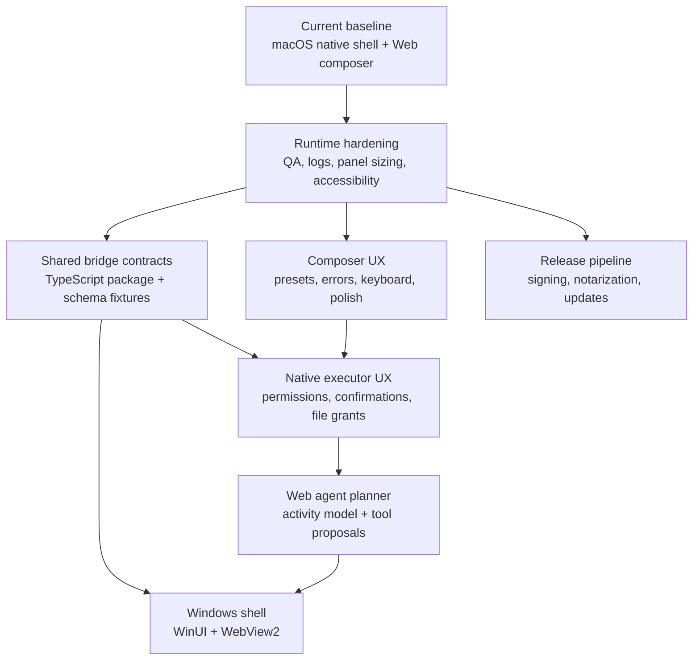

# Roadmap

This roadmap describes the planned development path from the current macOS app toward a cross-platform native shell plus shared Web composer architecture. It is organized by product capability and engineering risk, not by historical phases.

## Current Baseline

Inputo currently has:

- a macOS menu-bar app with a Spotlight-like floating composer
- native settings for provider configuration, API key storage, and shortcut recording
- app-level Jump anchors
- a React + TypeScript Web composer body hosted in `WKWebView`
- checked-in bundled Web assets generated from `packages/web-composer`
- a native executor bridge for allowlisted Web-to-native tool calls
- streaming OpenAI-compatible provider requests through native code
- Swift package tests, frontend tests, generated-asset verification, and CI

## Guiding Principles

- Keep OS privileges native.
- Keep Web UI reusable across macOS and future Windows.
- Keep Xcode builds independent of Node, pnpm install, a dev server, and network access.
- Keep bridge contracts explicit, versioned, typed, and policy-checked.
- Keep privacy defaults conservative: no automatic paste, no input/output history, no screenshots, no window-title capture, and no browser-side provider networking.

## Development Map

## Milestone 1: Runtime Hardening

Goal: make the current macOS runtime boringly reliable.

Work:

- verify Web composer rendering from the app bundle on clean builds
- keep the generated Web asset check in CI
- document expected WebKit/Xcode log noise
- test panel sizing across displays, full-screen Spaces, light/dark mode, and reduced-motion settings
- tighten focus handling between native shell and Web composer
- keep IME composition safe for Escape, Command-Return, and text editing shortcuts
- add accessibility labels or roles where Web controls are still weak
- decide how to expose local diagnostic information without leaking secrets

Exit criteria:

- fresh clone can build and run the macOS app
- Web composer is visible from the app bundle without running a dev server
- manual QA checklist in `docs/DEVELOPMENT.md` passes
- noisy but harmless WebKit logs are documented

## Milestone 2: Composer UX

Goal: make the composer feel like a polished daily tool.

Work:

- improve empty, loading, streaming, failed, cancelled, and copied states
- make provider setup errors actionable from the composer
- refine recipe selection and custom preset display
- improve keyboard navigation and screen-reader behavior
- add localization strategy before more UI strings spread
- improve visual density for smaller panels
- add regression tests for reducer edge cases and bridge error display

Exit criteria:

- common failures are understandable without opening logs
- keyboard-only use works for the core transform loop
- no UI state depends on browser storage

## Milestone 3: Shared Bridge Contracts

Goal: make native/Web contracts easy to reuse and hard to drift.

Work:

- move shared TypeScript bridge types into `packages/bridge-contracts-ts`
- decide which bridge DTOs should also live in `contracts`
- add schema or fixture validation for bridge envelopes
- add compatibility tests between Swift DTOs and TypeScript DTOs
- document versioning and deprecation rules
- keep React-specific state separate from framework-agnostic bridge contracts

Exit criteria:

- TypeScript bridge DTOs are imported from a shared package
- Swift and TypeScript agree on envelope shape through tests or fixtures
- contract changes require explicit fixture updates

## Milestone 4: Native Executor UX

Goal: make privileged native tools usable without weakening policy.

Work:

- design and implement confirmation UI for side-effecting tools
- expose permission status and permission request flows in Web UI where useful
- complete file grant UX around native picker/save-panel mediated access
- show tool-call proposals before execution for assisted workflows
- add cancellation and timeout behavior for long-running tools
- keep `network.fetch` denied until manifest-governed network policy exists

Exit criteria:

- Web can request approved native capabilities through visible user intent
- file access is grant-scoped, not path-based
- side effects are test-covered and policy-checked

## Milestone 5: Web Agent Planner

Goal: let Web orchestrate multi-step workflows while native remains the executor.

Work:

- add an activity timeline model
- introduce tool proposal and approval states
- let Web coordinate `llm.stream` plus native executor tools
- add renderer slots for tool results
- define safe pure-Web tools separately from privileged native tools
- preserve cancellation, event ordering, and error redaction

Exit criteria:

- Web can plan a workflow but cannot bypass native executor policy
- every privileged action is visible, cancellable where appropriate, and auditable in UI

## Milestone 6: Windows Shell Preparation

Goal: make the existing architecture portable to a WinUI/WebView2 host.

Work:

- define the Windows app folder shape under `apps/windows`
- mirror the native bridge host over WebView2
- map credentials to Windows Credential Manager
- map app anchors to Win32 app/window activation
- reuse `packages/web-composer` and shared bridge contracts
- keep Windows-specific platform services separate from shared contracts

Exit criteria:

- Windows can load the same Web composer bundle
- platform services are native equivalents, not Web workarounds
- shared contracts do not assume AppKit or SwiftUI

## Milestone 7: Release Pipeline

Goal: prepare Inputo for repeatable external testing.

Work:

- decide app identifier, signing, and entitlement policy
- add release build verification
- add notarization and packaging notes
- define update strategy
- add privacy statement and diagnostic logging policy
- document supported macOS versions and provider compatibility

Exit criteria:

- a release candidate can be built from a clean checkout
- signing/notarization steps are documented and repeatable
- runtime privacy claims match implementation

## Near-Term Backlog

Highest priority:

- continue runtime QA for the fixed Web composer bundle
- add bridge contract drift checks between Swift and TypeScript
- improve composer error states and provider setup handling
- design confirmation UI for native side effects
- keep docs and CI aligned with the monorepo layout

Intentionally deferred:

- autonomous Web agent planning
- manifest-governed network tools
- external MCP or connector execution
- automatic paste
- screenshots or window-title capture
- moving settings fully into Web

## Definition of Done

For any meaningful feature slice:

- Swift package tests pass
- Xcode Debug build passes
- frontend `pnpm run verify` passes when Web source or bundled assets change
- generated Web assets are committed with their source changes
- docs are updated when architecture, commands, paths, or privacy boundaries change
- manual QA covers the affected composer, settings, provider, bridge, or OS-integration flow
