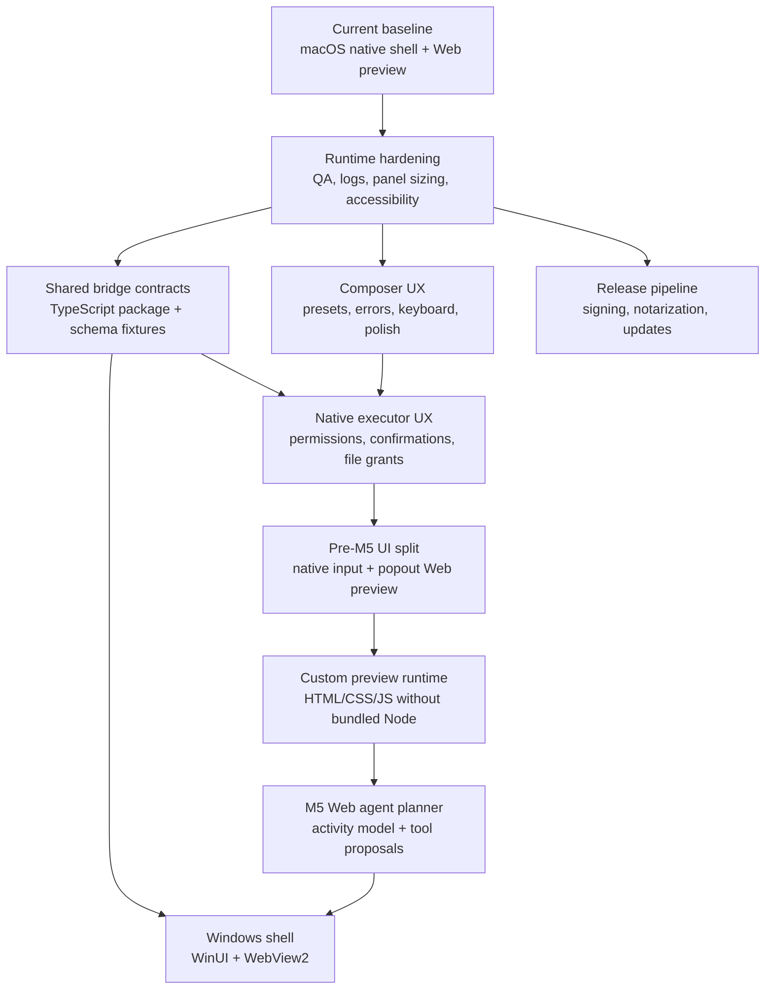

# Roadmap

This roadmap describes the development path from the current macOS app toward a cross-platform native shell plus customizable Web preview architecture. It is organized by product capability and engineering risk, not by historical phases.

## Current Baseline

Inputo currently has:

- a macOS menu-bar app with a Spotlight-like floating composer
- native settings for provider configuration, API key storage, and shortcut recording
- app-level Jump anchors
- native `/command` input and built-in command routing for transforms such as `/polish` and `/translate`
- a React + TypeScript Web preview pop window hosted in `WKWebView`
- checked-in bundled Web assets generated from `packages/web-composer`
- a native executor bridge for allowlisted Web-to-native tool calls
- shared TypeScript bridge contracts with Swift/Web drift checks
- streaming OpenAI-compatible provider requests through native code
- grant-scoped file read/write UX behind native confirmation in assisted workflow mode
- compact Web diagnostics and permission-state surfaces that expose only safe setup metadata
- Swift package tests, frontend tests, generated-asset verification, and CI

Milestones 1 through 4 are implemented as the foundation, and the Pre-M5 UI split is implemented on top: native owns text input and command routing, while Web owns the preview and future agent surface.

Formal milestone closure still requires a completed manual runtime QA pass using [docs/MILESTONE_RUNTIME_QA.md](MILESTONE_RUNTIME_QA.md), especially for display placement, full-screen Spaces, appearance, reduced motion, IME, VoiceOver, native confirmation, and file-grant flows.

## Guiding Principles

- Keep OS privileges native.
- Keep Web UI reusable across macOS and future Windows.
- Keep Xcode builds independent of Node, pnpm install, a dev server, and network access.
- Keep bridge contracts explicit, versioned, typed, and policy-checked.
- Keep privacy defaults conservative: no automatic paste, no input/output history, no screenshots, no window-title capture, and no browser-side provider networking.
- Keep native input fast and reliable, especially for keyboard shortcuts, IME, command parsing, provider credentials, and built-in commands.
- Keep Web preview extensible, but add browser/network/runtime capabilities in explicit opt-in slices instead of bundling a Node runtime by default.

## Development Map

## Completed Foundation: Milestones 1-4

The current foundation combines:

- Milestone 1 runtime hardening: bundled Web assets, WKWebView constraints, CI checks, expected WebKit log documentation, focus/keyboard/IME safeguards, and repeatable QA checklist.
- Milestone 2 composer UX: actionable provider setup, polished generation/cancel/copy/clear states, compact panel styling, keyboard flow, accessibility labels, stale-event protection, and reducer/controller tests.
- Milestone 3 shared bridge contracts: `packages/bridge-contracts-ts`, `contracts/bridge-tools.v1.json`, Swift/Web drift checks, and contract ownership docs.
- Milestone 4 native executor UX: native-mediated per-call confirmation, permission state surfacing, grant-scoped file read/write UX, cancellation semantics, and policy tests.

Remaining closure work for this foundation is manual QA evidence, not new architecture.

## Near-Term Replan

The original next step was Milestone 5, the Web Agent Planner. It remains downstream of the new preview boundary because building the planner on top of the old all-in-Web composer would have made the agent UI depend on controls that now live in native.

Priority order:

1. Customizable Web preview runtime v1 without a bundled Node runtime.
2. Milestone 5 Web Agent Planner on top of the new preview boundary.
3. Optional Node or Bun sidecar for arbitrary npm projects, deferred until the no-Node runtime is not enough.

## Pre-M5: Native Input And Web Preview Split

Status: implemented. Manual runtime QA is still needed.

Goal: move input, command parsing, and built-in transform execution to native while Web becomes a hidden-by-default popout preview surface.

P0 scope:

- replace the Web-owned draft editor, instruction field, preset picker, and primary action controls with native UI
- parse all user instructions from a single native input box using `/command` syntax
- implement native built-in commands such as `/polish` and `/translate` by sending provider requests from native
- stream native built-in command results through the bridge into the Web preview
- show the Web preview pop window only when bridge data is delivered to Web
- keep provider setup, credentials, hotkeys, panel lifecycle, settings, anchors, clipboard, and native permissions native-owned
- send unrecognized `/command` input to Web through the bridge as full text so community-defined Web commands can orchestrate from there

Exit criteria:

- the app can run built-in `/polish` and `/translate` flows with native input and Web preview output
- Web preview is not visible at idle and appears only when native sends preview data or a Web command flow starts
- current manual copy, cancel, provider error, IME, Escape, and shortcut behavior still work
- bridge events distinguish native result previews from Web-routed command requests
- docs, privacy claims, tests, and generated Web assets match the new boundary

Non-goals:

- no Node, Bun, npm install, Vite dev server, or local project runner inside the shipped app
- no automatic paste
- no screenshots, window-title capture, or target-control capture
- no broad browser networking by default
- no autonomous background agent execution

## Preview Runtime V1

Goal: make the Web preview meaningfully customizable without adding a bundled Node runtime.

P0 scope:

- support preview payloads for plain text, markdown, safe HTML, and small self-contained HTML/CSS/JavaScript documents
- isolate dynamic preview documents from the privileged native bridge, preferably with a sandboxed iframe or a separate restricted WebView
- define an explicit preview payload schema with type, content, metadata, and capability flags
- keep native-to-Web bridge data display-safe and avoid exposing credentials, local paths, stack traces, or raw provider internals
- keep default network access disabled; any future browser networking should be opt-in, policy-controlled, and documented before implementation

Exit criteria:

- LLM output can render as richer preview content than a textarea without giving that content direct native privileges
- bundled app builds still do not require Node, pnpm install, a dev server, or network access
- Web preview crashes or script errors do not break native input or settings

## Milestone 5: Web Agent Planner

Goal: let Web orchestrate multi-step workflows while native remains the executor.

M5 is now downstream of the Pre-M5 UI split and Preview Runtime V1. The planner should be built as a Web preview/agent layer, not as an extension of the old Web-owned composer controls.

P0 scope:

- add an activity timeline model for generation, proposals, approvals, tool results, failures, and cancellation
- introduce tool proposal and approval states in Web without allowing Web to bypass native policy
- let Web coordinate `llm.stream` plus native tool proposals using existing bridge contracts
- add renderer slots for safe tool results
- define safe pure-Web tools separately from privileged native tools
- preserve request ordering, cancellation, late-event handling, and display-safe errors

Non-goals for the first M5 slice:

- no autonomous background execution
- no manifest-governed `network.fetch`
- no external MCP or connector runtime
- no screenshots, window-title capture, automatic paste, or browser-side provider networking
- no persistence of prompts, generated output, activity history, or local file paths

Exit criteria:

- Web can plan a visible workflow but cannot execute privileged actions without native policy
- every privileged action is represented as a proposal and remains cancellable or rejectable where appropriate
- timeline state is test-covered for completion, failure, cancellation, and stale events
- docs and privacy claims still match implementation

## Milestone 6: Windows Shell Preparation

Goal: make the existing architecture portable to a WinUI/WebView2 host.

Work:

- define the Windows app folder shape under `apps/windows`
- mirror the native bridge host over WebView2
- map credentials to Windows Credential Manager
- map app anchors to Win32 app/window activation
- reuse `packages/web-composer` and shared bridge contracts
- keep Windows-specific platform services separate from shared contracts

Exit criteria:

- Windows can load the same Web preview bundle
- platform services are native equivalents, not Web workarounds
- shared contracts do not assume AppKit or SwiftUI

## Milestone 7: Release Pipeline

Goal: prepare Inputo for repeatable external testing.

Work:

- decide app identifier, signing, and entitlement policy
- add release build verification
- add notarization and packaging notes
- define update strategy
- add privacy statement and diagnostic logging policy
- document supported macOS versions and provider compatibility

Exit criteria:

- a release candidate can be built from a clean checkout
- signing/notarization steps are documented and repeatable
- runtime privacy claims match implementation

## Near-Term Backlog

Highest priority:

- design Preview Runtime V1 for markdown, safe HTML, and self-contained HTML/CSS/JavaScript without bundling Node
- start Milestone 5 with visible activity timeline and tool proposal state after the split is stable
- finish manual runtime QA for the native input and Web preview split
- finish manual runtime QA across display, Space, appearance, reduced-motion, IME, and VoiceOver scenarios
- keep bridge contract fixtures, Swift DTOs, TypeScript DTOs, generated assets, and docs updated together
- keep docs and CI aligned with the monorepo layout

Intentionally deferred:

- bundled Node, Bun, npm install, or arbitrary local project execution inside the app
- manifest-governed network tools
- external MCP or connector execution
- advanced diagnostics export
- translation rollout beyond the current centralized Web string map
- automatic paste
- screenshots or window-title capture
- moving settings fully into Web

## Definition of Done

For any meaningful feature slice:

- Swift package tests pass
- Xcode Debug build passes
- frontend `pnpm run verify` passes when Web source or bundled assets change
- generated Web assets are committed with their source changes
- docs are updated when architecture, commands, paths, or privacy boundaries change
- manual QA covers the affected composer, settings, provider, bridge, or OS-integration flow
