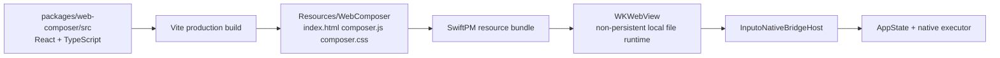

# Web Composer

The Inputo composer body is a bundled Web surface hosted inside the native macOS app. Source code lives in `packages/web-composer`; production assets are generated into the SwiftPM resource bundle and loaded by `WKWebView`.

## Runtime Shape



The app runtime does not use a dev server, remote JavaScript, remote CSS, browser-side provider fetch, or browser storage. Xcode builds consume the checked-in generated assets.

## Source Layout

```text
packages/web-composer/
  index.html
  package.json
  vite.config.ts
  vitest.config.ts
  scripts/check-generated-assets.mjs
  src/
    App.tsx
    main.tsx
    bridge/
      bridgeClient.ts
      types.ts
    state/
      composer.ts
    styles/
      composer.css
    __tests__/
```

## Development

Install dependencies:

```bash
cd packages/web-composer
npm install
```

Run the browser dev server:

```bash
npm run dev
```

The dev server is for fast React iteration only. In that environment the native bridge is unavailable, so bridge calls return safe internal errors. Use it to work on layout, reducer behavior, theme styling, and basic UI states. Use the macOS app for real bridge and provider behavior.

Run frontend tests:

```bash
npm test
```

Typecheck:

```bash
npm run typecheck
```

Full Web verification:

```bash
npm run verify
```

## Building for the App

Generate production assets:

```bash
cd packages/web-composer
npm run build
```

Output path:

```text
../../apps/macos/InputoModules/Sources/InputoComposerFeature/Resources/WebComposer
```

Generated files:

- `index.html`
- `composer.js`
- `composer.css`

The production `index.html` intentionally uses a classic script tag:

```html
<script defer src="./composer.js"></script>
```

Vite source development still uses ES modules. The bundled WKWebView runtime uses the classic production tag because local `file://` module scripts are fragile in WebKit. Do not change the generated app asset back to `type="module"`.

## Asset Consistency

`npm run check:assets` builds into a temporary directory and compares the result with the checked-in app bundle assets. CI runs the same verification.

If the check fails:

```bash
cd packages/web-composer
npm run build
npm run check:assets
```

Commit the source and regenerated app assets together.

## Native Bridge

Web calls native through `window.webkit.messageHandlers.inputoNative.postMessage(...)`. The Web bridge client wraps this in typed `tool.call` envelopes and receives `tool.result` or `event` envelopes through `window.InputoNativeBridgeReceiveBase64`.

Common tools used by the composer:

- `app.snapshot`
- `app.hideComposer`
- `composer.setDraft`
- `composer.setInstruction`
- `composer.selectRecipe`
- `composer.clear`
- `llm.stream`
- `llm.cancel`
- `clipboard.copyGeneratedOutput`

Native events used by the composer:

- `llm.started`
- `llm.delta`
- `llm.completed`
- `llm.failed`
- `llm.cancelled`

The native snapshot is authoritative for settings, recipes, permissions, and initial composer state. Web keeps local interaction state for responsiveness, then synchronizes through explicit tools.

## Security Constraints

The generated HTML uses a restrictive Content Security Policy:

- `default-src 'self'`
- `connect-src 'none'`
- `object-src 'none'`
- `frame-src 'none'`
- `worker-src 'none'`
- `font-src 'none'`

The WKWebView host also uses:

- non-persistent `WKWebsiteDataStore`
- local file loading from the bundled asset directory only
- navigation restrictions to the asset directory
- a content rule list that blocks `http` and `https` resources
- no browser-side provider networking
- no localStorage, sessionStorage, IndexedDB, service worker, WebSocket, or XMLHttpRequest usage in the bundle

## Debugging

For React-only UI issues:

```bash
cd packages/web-composer
npm run dev
```

For production bundle issues:

```bash
cd packages/web-composer
npm run build
python3 -m http.server 5174 --directory ../../apps/macos/InputoModules/Sources/InputoComposerFeature/Resources/WebComposer
```

Open `http://127.0.0.1:5174` in a browser to inspect the generated files. The native bridge will be unavailable in this mode, but the UI should still render and show a bridge error instead of a blank page.

For WKWebView runtime issues:

1. Rebuild Web assets with `npm run build`.
2. Rebuild the macOS app.
3. Confirm generated `index.html` uses `<script defer src="./composer.js"></script>`.
4. Confirm generated `index.html` does not contain `type="module"` or `crossorigin`.
5. Confirm SwiftPM can find the assets with `swift test --package-path apps/macos/InputoModules`.
6. If the app still appears blank, clean Xcode DerivedData for Inputo and rebuild.

Safari Web Inspector can inspect WKWebView content when the system and Safari developer settings allow WebView inspection. Use it only for local debugging; do not add remote scripts or relax the production CSP to make debugging easier.
