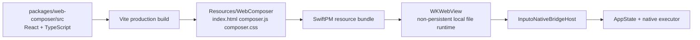

# Web Preview

The Inputo preview pop window is a bundled Web surface hosted inside the native macOS app. Source code lives in `packages/web-composer`; production assets are generated into the SwiftPM resource bundle and loaded by `WKWebView`.

Native owns input and `/command` routing. Web owns preview rendering and the current placeholder intake for commands native does not recognize.

## Runtime Shape



The app runtime does not use a dev server, remote JavaScript, remote CSS, browser-side provider fetch, or browser storage. Xcode builds consume the checked-in generated assets.

Preview Runtime V1 preserves that property. The shipped app does not require Node, Bun, npm install, a Vite dev server, or network access just to render previews.

## Preview Runtime V1

The Web preview includes a restricted no-Node runtime that can render richer output while staying inside the existing bundled Web asset model.

Preview payloads support:

- plain text
- markdown
- safe HTML
- small self-contained HTML/CSS/JavaScript documents

Dynamic preview documents render in a sandboxed iframe. The React shell receives bridge events, decides what to render, reports display-safe preview errors, and keeps dynamic documents from calling native tools directly. Native also ignores bridge messages from non-main frames, so iframe content cannot bypass the shell by calling `window.webkit.messageHandlers.inputoNative`.

Network access should remain disabled by default. If browser-side networking is added later, it should be a separate manifest-governed capability with explicit policy, user-facing documentation, and privacy review.

Supported command shortcuts for the current V1 renderer:

- `/text ...`
- `/md ...` or `/markdown ...`
- `/html ...`
- `/preview ...`, `/web ...`, or `/document ...`
- `/render text|markdown|html|document ...`

The command body can also be a JSON `PreviewPayload` with `kind`, `content`, optional `title`/`metadata`, and `capabilities`. V1 always forces `allowNetwork` to `false`.

## Source Layout

```text
packages/web-composer/
  index.html
  package.json
  vite.config.ts
  vitest.config.ts
  scripts/check-generated-assets.mjs
  src/
    app/
      App.tsx
      main.tsx
      styles/
        composer.css
    features/
      composer/
        components/
          ComposerScreen.tsx
          PreviewRuntime.tsx
        hooks/
          useComposerController.ts
          useComposerController.test.ts
        model/
          composerStrings.ts
          composerReducer.ts
          composerReducer.test.ts
          previewRuntime.ts
          previewRuntime.test.ts
    shared/
      bridge/
        bridgeClient.ts
        bridgeClient.test.ts
        contractDrift.test.ts
    env.d.ts
packages/bridge-contracts-ts/
  src/
    index.ts
```

`src/app` owns bootstrapping and app-level shell composition. `src/features` owns feature UI, hooks, state, UI strings, and colocated tests. `src/shared` is for cross-feature infrastructure such as the native bridge client. Framework-agnostic bridge DTOs live in `packages/bridge-contracts-ts`.

## Development

Install dependencies:

```bash
cd packages/web-composer
pnpm install
```

Run the browser dev server:

```bash
pnpm run dev
```

The dev server is for fast React iteration only. In that environment the native bridge is unavailable, so bridge calls return safe internal errors. Use it to work on layout, reducer behavior, theme styling, and basic UI states. Use the macOS app for real bridge and provider behavior.

Run frontend tests:

```bash
pnpm test
```

Typecheck:

```bash
pnpm run typecheck
```

Full Web verification:

```bash
pnpm run verify
```

`pnpm run verify` typechecks the shared bridge contracts before typechecking, testing, building, and checking generated Web assets.

## Building for the App

Generate production assets:

```bash
cd packages/web-composer
pnpm run build
```

Output path:

```text
../../apps/macos/InputoModules/Sources/InputoComposerFeature/Resources/WebComposer
```

Generated files:

- `index.html`
- `composer.js`
- `composer.css`

The production `index.html` intentionally uses a classic script tag:

```html
<script defer src="./composer.js"></script>
```

Vite source development still uses ES modules. The bundled WKWebView runtime uses the classic production tag because local `file://` module scripts are fragile in WebKit. Do not change the generated app asset back to `type="module"`.

## Asset Consistency

`pnpm run check:assets` builds into a temporary directory and compares the result with the checked-in app bundle assets. CI runs the same verification.

If the check fails:

```bash
cd packages/web-composer
pnpm run build
pnpm run check:assets
```

Commit the source and regenerated app assets together.

## Native Bridge

Web calls native through `window.webkit.messageHandlers.inputoNative.postMessage(...)`. The Web bridge client wraps this in typed `tool.call` envelopes and receives `tool.result` or `event` envelopes through `window.InputoNativeBridgeReceiveBase64`.

Common tools still available to the Web preview:

- `app.snapshot`
- `app.hideComposer`
- `llm.cancel`
- `clipboard.copyGeneratedOutput`
- `settings.open`
- `files.pickReadable`
- `files.readText`
- `files.pickWritable`
- `files.writeText`

Native events used by the preview:

- `command.received`
- `preview.render`
- `llm.started`
- `llm.delta`
- `llm.completed`
- `llm.failed`
- `llm.cancelled`

The native snapshot is authoritative for settings, recipes, permissions, and initial state. Web keeps local preview state for native streaming output and unrecognized command payloads.

Generation events are tied to request IDs. Web ignores late events after cancellation, clear, or a different active request so stale streaming deltas cannot restore old output.

Current bridge responsibilities:

- native built-in commands stream preview deltas or final preview payloads to Web
- unknown `/command` input is forwarded to Web as `command.received` with the complete input text
- explicit preview payloads are delivered as `preview.render`
- Web preview reports display-safe runtime errors without exposing stack traces, local paths, credentials, or raw provider internals
- native controls the preview pop window lifecycle and opens it when preview or command data is delivered

## Security Constraints

The generated HTML uses a restrictive Content Security Policy:

- `default-src 'self'`
- `connect-src 'none'`
- `object-src 'none'`
- `frame-src 'self' data: blob:`
- `worker-src 'none'`
- `font-src 'none'`

The WKWebView host also uses:

- non-persistent `WKWebsiteDataStore`
- local file loading from the bundled asset directory only
- navigation restrictions to the asset directory
- main-frame-only native bridge message handling
- sandboxed iframe rendering for self-contained preview documents
- a content rule list that blocks `http` and `https` resources
- no browser-side provider networking
- no localStorage, sessionStorage, IndexedDB, service worker, WebSocket, or XMLHttpRequest usage in the bundle

Preview Runtime V1 keeps the React shell under these constraints. Dynamic HTML/CSS/JavaScript previews run in an iframe with `connect-src 'none'`, no same-origin sandbox permission, no form submission, no nested frames, no remote scripts, and no native bridge access.

## Debugging

For React-only UI issues:

```bash
cd packages/web-composer
pnpm run dev
```

For production bundle issues:

```bash
cd packages/web-composer
pnpm run build
python3 -m http.server 5174 --directory ../../apps/macos/InputoModules/Sources/InputoComposerFeature/Resources/WebComposer
```

Open `http://127.0.0.1:5174` in a browser to inspect the generated files. The native bridge will be unavailable in this mode, but the UI should still render and show a bridge error instead of a blank page.

For WKWebView runtime issues:

1. Rebuild Web assets with `pnpm run build`.
2. Rebuild the macOS app.
3. Confirm generated `index.html` uses `<script defer src="./composer.js"></script>`.
4. Confirm generated `index.html` does not contain `type="module"` or `crossorigin`.
5. Confirm SwiftPM can find the assets with `swift test --package-path apps/macos/InputoModules`.
6. If the app still appears blank, clean Xcode DerivedData for Inputo and rebuild.

Safari Web Inspector can inspect WKWebView content when the system and Safari developer settings allow WebView inspection. Use it only for local debugging; do not add remote scripts or relax the production CSP to make debugging easier.
