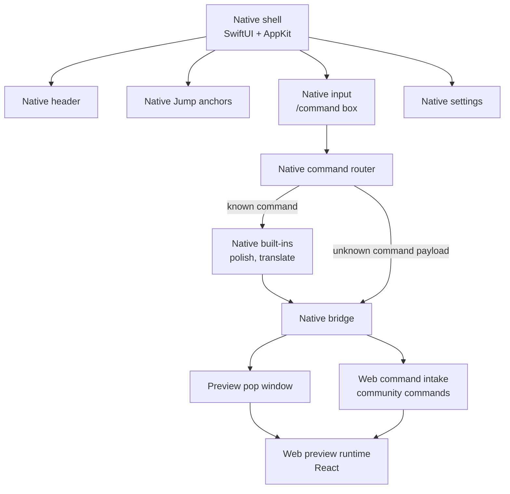
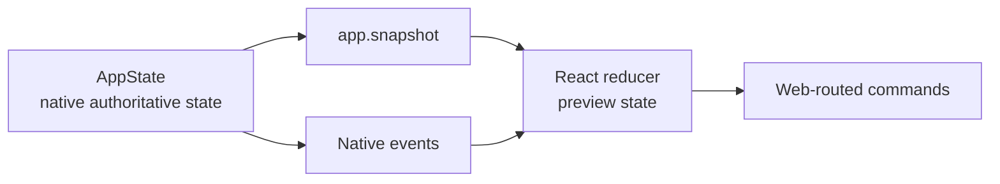

# Web UI Architecture

Inputo uses native UI for the command input while keeping Web as a contributor-friendly preview and future agent surface. Privileged OS capabilities stay native.

## Current Surface

The native shell owns the window material, panel placement, menu bar, shortcut, settings window, app anchors, command input, and preview pop window lifecycle. The preview pop window is hidden by default. Native shows it when bridge data is delivered to Web, such as native LLM deltas, final preview payloads, or unknown command payloads that Web will orchestrate.

## State Model

Native state is authoritative. React keeps preview state from bridge snapshots and native events.

Streaming events are request-scoped. The reducer ignores native events for any request that is no longer active, which prevents cancelled or cleared generations from repainting stale output when late deltas arrive.

Native owns the edit state for the input box and command execution state for native built-ins. Web state focuses on preview rendering, Web-routed command activity, and future agent timeline state.

## Rendering Responsibilities

Web renders:

- generated preview payloads from native built-in commands
- Web-routed community command output
- text preview output
- future activity timeline and tool proposal UI
- display-safe errors and preview runtime failures

Native renders:

- main input box
- `/command` parsing feedback
- built-in command execution state for `/polish`, `/translate`, and similar native instructions
- settings and provider setup
- app anchors and shortcut-driven panel lifecycle
- preview pop window lifecycle
- native confirmation alerts for privileged tools

## Bridge Rules

Web must use the bridge client. It should not call `window.webkit` directly from components. Feature hooks should call typed functions in `src/shared/bridge/bridgeClient.ts`; framework-agnostic bridge DTOs live in `packages/bridge-contracts-ts`.

All native calls should be:

- versioned
- allowlisted
- typed
- cancellation-aware where relevant
- explicit about user-action context for side effects
- resilient to display-safe errors

Web cannot grant itself elevated authority. For per-call confirmed tools, the native dispatcher invokes native confirmation before executing. Web can render proposals or buttons, but the confirmation decision remains native-mediated.

The bridge includes native-to-Web command and preview events instead of making Web poll for input state:

- native result preview events for built-in command streaming and final output via `llm.*`
- `command.received` events that carry the full user input text to Web
- `preview.render` events that carry explicit `PreviewPayload` data for text, markdown, safe HTML, or isolated document rendering
- preview lifecycle notifications so native can open the pop window when Web has meaningful data
- display-safe runtime error events from Web back to native when needed

## Web Agent Boundary

The current Web surface is a preview and command-intake layer, not an autonomous agent. Any future planner must still use the same native executor policy.

Allowed future Web-owned work:

- rendering unknown command flows
- rendering Preview Runtime V1 payloads in the shell or sandboxed iframe
- activity timeline UI
- tool proposal UI
- confirmation UI
- pure browser-side formatting/rendering helpers
- framework-agnostic tool manifests

Native-owned work that should not move to Web:

- provider credentials
- provider networking for built-in provider calls
- clipboard writes
- file picker/save panel grants
- app activation
- OS permission prompts
- hotkeys
- window discovery
- settings persistence

## Compatibility Targets

The Web preview should work in:

- macOS `WKWebView` from local bundled files
- future Windows WebView2 from local bundled files
- a Vite dev server for UI development
- a static browser preview for generated-asset inspection

The production bundle should avoid assumptions that only work on localhost. In particular, production assets use relative URLs, no remote resources, no service worker, no browser storage, and a classic script tag for the local-file WKWebView runtime.

Preview Runtime V1 does not require a bundled Node, Bun, npm install, Vite dev server, or local project runner. Text, markdown, and safe HTML render in the React shell. Self-contained HTML/CSS/JavaScript documents render in a sandboxed iframe with network disabled and no direct native bridge privileges. Node/Bun/project-runner capabilities are deferred until a later runtime slice, if the no-Node preview model cannot support the product needs.

## UI Design Constraints

The preview pop window should stay focused on the rendered result rather than becoming a marketing page or general browser shell.

Maintain these constraints:

- no nested cards
- no large hero typography
- no decorative backgrounds inside the WebView
- stable dimensions for controls and panels
- text must fit at compact panel sizes
- IME composition must remain reliable
- Escape must not close the panel while composition is active
- Command-Return should generate
- generated output must be copied only after explicit user action
- runtime diagnostics must not show prompts, output, credentials, raw provider URLs, local paths, screenshots, or stack traces
