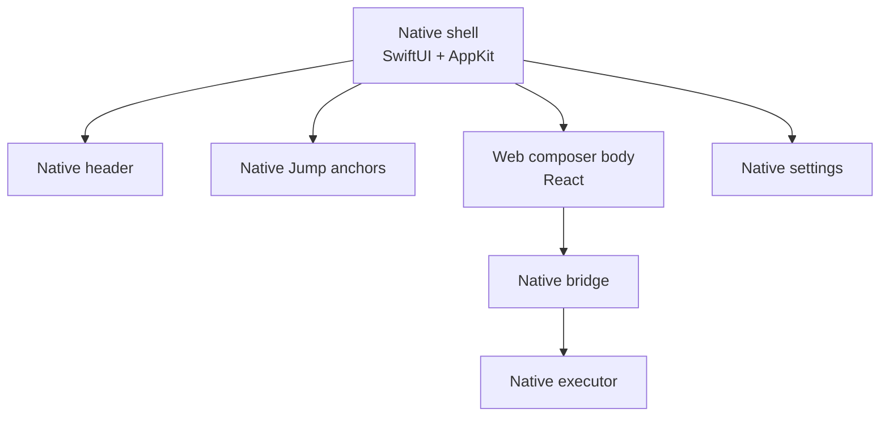
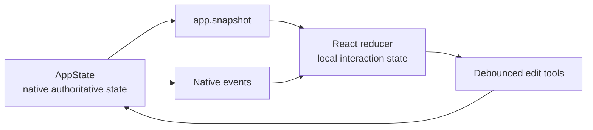

# Web UI Architecture

Inputo uses Web UI for the composer body while keeping the platform shell native. This gives the product a contributor-friendly React surface without moving privileged OS capabilities into JavaScript.

## Current Surface

The native shell owns the window, material background, panel placement, menu bar, shortcut, settings window, and app anchors. Web owns the composer body below the native anchor row.

## State Model

Native state is authoritative. React keeps local state to make editing responsive, then synchronizes through explicit bridge tools.

Streaming events are request-scoped. The reducer ignores native events for any request that is no longer active, which prevents cancelled or cleared generations from repainting stale output when late deltas arrive.

## Rendering Responsibilities

Web renders:

- generated preview
- recipe picker
- instruction field
- draft editor
- Generate, Cancel, Clear, and Copy controls
- generation status and display-safe errors
- native streaming deltas
- provider setup state from a non-secret native summary
- native file-tool availability and grant-based read/write actions when policy allows them
- permission status labels from native snapshots
- a compact runtime diagnostics summary that contains only safe setup and contract metadata

Native renders:

- title/header
- settings button
- provider setup banner
- app anchor bar
- settings window
- floating panel material and lifecycle
- native confirmation alerts for per-call confirmed tools

## Bridge Rules

Web must use the bridge client. It should not call `window.webkit` directly from components. Feature hooks should call typed functions in `src/shared/bridge/bridgeClient.ts`; framework-agnostic bridge DTOs live in `packages/bridge-contracts-ts`.

All native calls should be:

- versioned
- allowlisted
- typed
- cancellation-aware where relevant
- explicit about user-action context for side effects
- resilient to display-safe errors

Web cannot grant itself elevated authority. For per-call confirmed tools, the native dispatcher invokes native confirmation before executing. Web can render proposals or buttons, but the confirmation decision remains native-mediated.

## Web Agent Boundary

The current Web surface is a composer, not an autonomous agent. Any future planner must still use the same native executor policy.

Allowed future Web-owned work:

- activity timeline UI
- tool proposal UI
- confirmation UI
- pure browser-side formatting/rendering helpers
- framework-agnostic tool manifests

Native-owned work that should not move to Web:

- provider credentials
- provider networking for built-in provider calls
- clipboard writes
- file picker/save panel grants
- app activation
- OS permission prompts
- hotkeys
- window discovery
- settings persistence

## Compatibility Targets

The Web composer should work in:

- macOS `WKWebView` from local bundled files
- future Windows WebView2 from local bundled files
- a Vite dev server for UI development
- a static browser preview for generated-asset inspection

The production bundle should avoid assumptions that only work on localhost. In particular, production assets use relative URLs, no remote resources, no service worker, no browser storage, and a classic script tag for the local-file WKWebView runtime.

## UI Design Constraints

The composer body is part of a compact tool surface, not a landing page. It should stay dense, quiet, keyboard-friendly, and readable over native material.

Maintain these constraints:

- no nested cards
- no large hero typography
- no decorative backgrounds inside the WebView
- stable dimensions for controls and panels
- text must fit at compact panel sizes
- IME composition must remain reliable
- Escape must not close the panel while composition is active
- Command-Return should generate
- generated output must be copied only after explicit user action
- runtime diagnostics must not show prompts, output, credentials, raw provider URLs, local paths, screenshots, or stack traces
